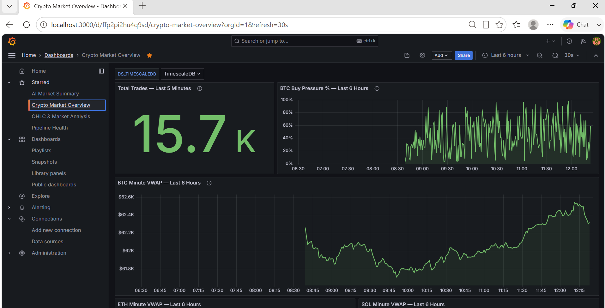
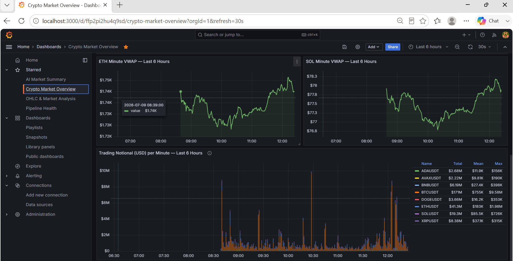
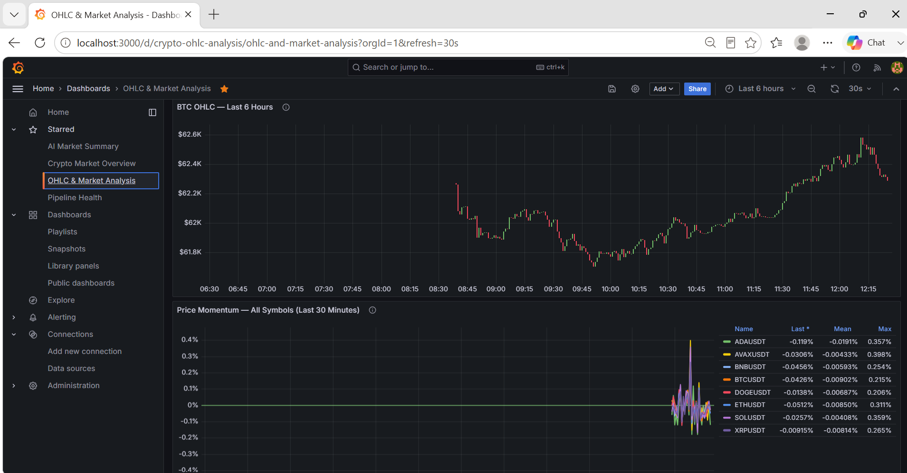
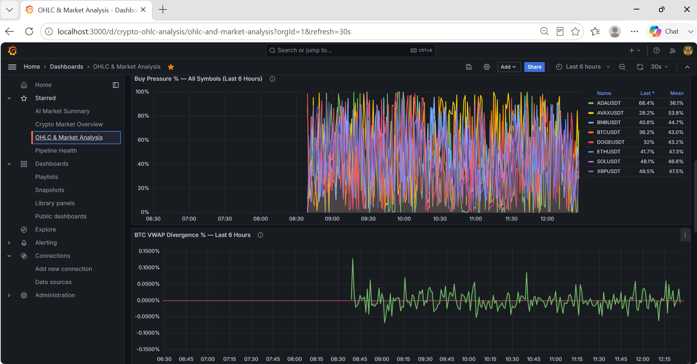
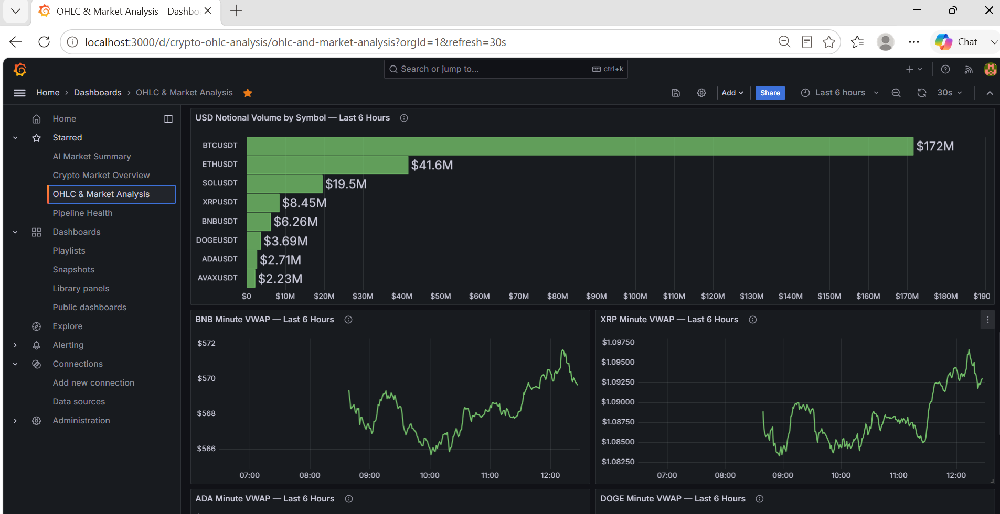
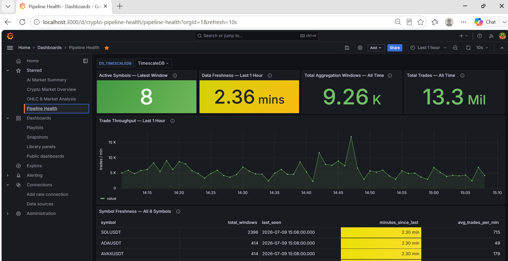
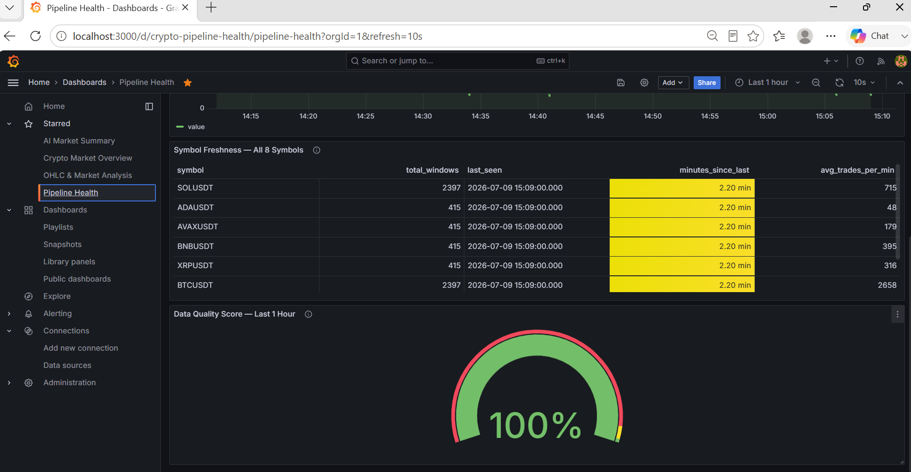
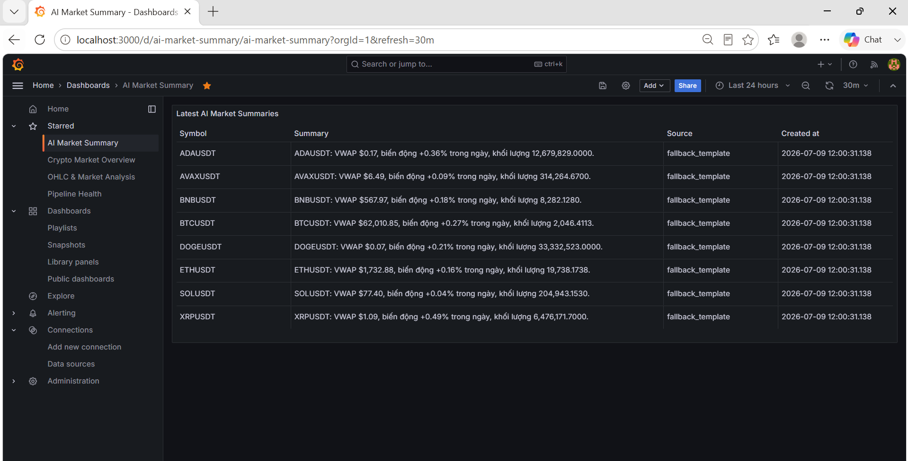

# Real-Time Crypto Streaming Pipeline


> End-to-end streaming data engineering project — Binance WebSocket → Apache Kafka → Spark Structured Streaming → PostgreSQL → Grafana



## Overview

This project builds a **production-oriented real-time data pipeline** that ingests live cryptocurrency trade events from Binance, processes them using Apache Kafka and Spark Structured Streaming, stores aggregated metrics in PostgreSQL (TimescaleDB), and visualizes them on live Grafana dashboards.

**Domain:** Fintech / Market Data  
**Data source:** Binance WebSocket API (real trades, no simulation)  
**Coverage:** 8 cryptocurrency symbols (BTC/ETH/SOL/BNB/XRP/ADA/DOGE/AVAX)<br>
**Runtime evidence:** 13.7M+ real trade events processed<br>
**Latency:** Sub-minute (window aggregation every 1 minute)

---

## Implemented Local Roadmap

The local project extends beyond the original four stages with implemented orchestration,
analytics and AI layers:

- **Day 1 — Observability UI (✅ Done)**: Kafdrop and pgAdmin expose Kafka topics/messages and TimescaleDB data in the browser.
- **Day 2 — dbt Transformation Layer (✅ Done)**: Bronze → Silver → Gold models provide validated metrics and daily rollups.
- **Day 3 — Airflow Orchestration (✅ Done)**: Airflow runs dbt and monitors Gold data freshness and symbol coverage.
- **Day 4 — AI Market Summary (✅ Done)**: resilient 30-minute Gemini summaries use a transparent template fallback.
> Local Stages 1–7 are implemented and verified. The short-lived Azure CV demo is deferred
> and remains a separate planned deployment.

---

## Architecture

```
Binance WebSocket API
        │  BTC / ETH / SOL / BNB / XRP / ADA / DOGE / AVAX (USDT pairs)
        ▼
Apache Kafka (KRaft mode)
  topic: crypto-trades
        │
        ▼
Spark Structured Streaming (PySpark)
  - Parse & validate JSON events
  - Tumbling window aggregation (1 min, 5 min)
  - Compute: VWAP, total volume, trade count, price change %
        │
        ├──▶ PostgreSQL (TimescaleDB extension)
        │      serving layer — Grafana reads here
        │
        ├──▶ dbt models (Bronze / Silver / Gold)
        │      clean metrics and rollups for analytics
        │
        └──▶ Local Parquet files
               historical storage — full raw events
                      │
                      ▼
               Grafana Dashboard
               BTC/ETH price, VWAP, volume heatmap (auto-refresh 10s)
```

---

## Tech Stack

| Layer | Technology | Role |
|---|---|---|
| Ingestion | Python `websockets` | Connect to Binance WebSocket stream |
| Message Queue | Apache Kafka (KRaft) | Buffer & decouple producer/consumer |
| Stream Processing | PySpark Structured Streaming | Window aggregation, VWAP computation |
| Transformation | dbt Core | Bronze / Silver / Gold modeling |
| Serving DB | PostgreSQL + TimescaleDB | Time-series optimized storage |
| Historical Storage | Parquet (local / Azure Blob-ready) | Full raw event archive |
| Orchestration | Apache Airflow 2.9 (standalone) | Run dbt and monitoring DAGs |
| AI Layer | Google Gemini API (`gemini-2.5-flash`) | Generate free market summaries |
| Dashboard | Grafana | Real-time visualization |
| Cloud | Azure VM + Blob Storage + Managed Identity + Grafana Cloud | Planned short-lived CV demo deployment |
| Infra | Docker Compose | Single-command local deployment |
| CI/CD | GitHub Actions | Tests, linting, type checks, JSON validation, dbt compile |

---

## Screenshots

### Dashboard 1 — Market Overview



### Dashboard 2 — OHLC & Market Analysis




### Dashboard 3 — Pipeline Health



### AI Market Summary (Gemini)


---

## Project Stages

### Stage 1 — Ingestion ✅ Done
Connect to Binance WebSocket and publish raw trade events to Kafka.

**What you build:**
- `ingestion/binance_producer.py` — WebSocket client for 8 symbols
- Kafka topic `crypto-trades` with KRaft (no Zookeeper)
- JSON schema: `symbol`, `price`, `quantity`, `trade_time`, `is_buyer_maker`

**Key learning:** Kafka producer API, KRaft mode, WebSocket async Python

---

### Stage 2 — Stream Processing ✅ Done
Consume from Kafka with Spark Structured Streaming and compute metrics.

**What you build:**
- `processing/spark_streaming.py` — PySpark job with raw Parquet and memory-optimized metric streams
- Tumbling window 1 min: `VWAP`, `total_volume`, `trade_count`, `price_open`, `price_close`
- Tumbling window 5 min: same metrics for trend view
- Watermark: 10 seconds (handle late data)

**Key learning:** Spark watermarks, window functions, foreachBatch sink

---

### Stage 3 — Storage ✅ Done
Sink processed data into PostgreSQL (TimescaleDB) and raw events to Parquet.

**What you build:**
- `storage/postgres_sink.py` — write aggregated metrics to hypertable
- TimescaleDB hypertables keyed by `window_start`
- Parquet sink partitioned by `symbol`

**Key learning:** TimescaleDB hypertables, idempotent PostgreSQL upserts, Parquet partitioning

---

### Stage 4 — Dashboard ✅ Done
Build provisioned Grafana dashboards for business metrics and pipeline health.

**What you build:**
- Grafana provisioning: datasource + dashboard as code (JSON)
- 3 dashboards: Market Overview, OHLC & Market Analysis, Pipeline Health with 24 panels total
- Docker Compose: all services in one command

**Key learning:** Grafana provisioning, Gold-layer metrics, Docker Compose networking

---

### Stage 5 — dbt Transformation ✅ Done
Transform Spark metrics through Bronze, Silver and Gold models with freshness and data-quality tests.

---

### Stage 6 — Airflow Orchestration ✅ Done
Schedule dbt, daily summaries, Gemini generation and Gold freshness monitoring with Airflow.

---

### Stage 7 — Gemini AI Summary ✅ Done
Generate Vietnamese market summaries with retryable Gemini calls and deterministic fallback templates.

---

## Quickstart

## How to Run

| Scenario | Command | `.env` file | Services started | Open in browser |
|---|---|---|---|---|
| Full pipeline local | `docker compose -f infrastructure/docker-compose.yml up -d` | `.env.docker` | Kafka, Postgres, Airflow, Producer, Spark, Grafana, Kafdrop, pgAdmin | `localhost:3000`, `localhost:9000`, `localhost:5050`, `localhost:8080` |
| Debug single script | `python ingestion/binance_producer.py` | `.env` | Only the script | — |
| Azure deploy | `docker compose -f infrastructure/docker-compose.azure.yml up -d` | `.env.docker` | Kafka, Postgres, Airflow, Producer, Spark | Grafana Cloud URL |

> ⚠️ NEVER run `docker compose down -v`.
> The `-v` flag permanently deletes all TimescaleDB data and Spark checkpoints.
> Always use `docker compose down` unless you intentionally want a full reset.

### Prerequisites
- Docker Desktop (4GB RAM allocated)
- Python 3.10+

### Run locally

```bash
# 1. Clone repo
git clone https://github.com/philipsgn/realtime-crypto-streaming-pipeline
cd realtime-crypto-streaming-pipeline

# 2. Copy env files
cp .env.example .env
cp .env.example .env.docker

# Edit .env.docker for containerized services and keep Docker DNS names:
# KAFKA_BOOTSTRAP_SERVERS=kafka:9093
# POSTGRES_HOST=postgres
# POSTGRES_PORT=5432

# 3. Build and start the full pipeline on first run
docker compose -f infrastructure/docker-compose.yml up -d --build

# 4. Start the full pipeline on later runs
docker compose -f infrastructure/docker-compose.yml up -d

# 5. Open Grafana
open http://localhost:3000   # username admin, password from GRAFANA_ADMIN_PASSWORD

# 6. Open observability UIs
# - Kafdrop (Kafka UI): http://localhost:9000
# - pgAdmin (Postgres UI): http://localhost:5050  — password from PGADMIN_DEFAULT_PASSWORD
```

After `up -d`, the producer and Spark services start automatically. Manual `make producer`
and `make spark-job` are now only for debugging outside Docker.

### How to run dbt

To run the dbt transformations (Bronze, Silver, Gold layers) against the TimescaleDB database:

```bash
cd dbt_project
dbt deps --profiles-dir .
dbt run --profiles-dir .
dbt test --profiles-dir .
```

### How to run Airflow

To run the Airflow standalone container and view DAGs:

```bash
docker compose -f infrastructure/docker-compose.yml up -d airflow
```
- Access Airflow UI: http://localhost:8080
- Credentials: username `admin`, password from `AIRFLOW_ADMIN_PASSWORD`

### Make commands

```bash
make up          # build/start full local Compose stack
make down        # docker compose down
make producer    # debug Binance WebSocket producer outside Docker
make spark-job   # debug Spark Structured Streaming job outside Docker
make logs        # tail all container logs
make clean       # stop containers without deleting named volumes
```

---

## Project Structure

```
realtime-crypto-streaming-pipeline/
├── ingestion/
│   └── binance_producer.py      # Binance WebSocket → Kafka producer
├── processing/
│   └── spark_streaming.py       # PySpark Structured Streaming job
├── storage/
│   ├── init.sql                 # TimescaleDB schema and hypertables
│   └── postgres_sink.py         # TimescaleDB write helpers
├── dbt_project/
│   ├── dbt_project.yml
│   ├── profiles.yml
│   └── models/
│       ├── bronze/              # Source-aligned raw trade models
│       ├── silver/              # Clean validated trade models
│       └── gold/                # Serving tables for Grafana
├── dags/
│   ├── dbt_hourly_dag.py         # dbt orchestration
│   ├── kafka_lag_monitor_dag.py  # Gold freshness and symbol coverage
│   ├── daily_summary_dag.py      # daily Gold report
│   ├── ai_market_summary_dag.py  # Gemini summaries
│   └── utils/
│       └── gold_queries.py       # Gold-layer SQL helpers
├── ai/
│   └── gemini_summary.py         # Market summary script using Gemini API
├── dashboard/
│   └── grafana/
│       └── provisioning/
│           ├── datasources/      # PostgreSQL datasource provisioning
│           └── dashboards/       # Grafana dashboards as code
├── infrastructure/
│   ├── docker-compose.yml        # Full local stack orchestration
│   ├── docker-compose.azure.yml  # Short-lived Azure demo stack
│   ├── Dockerfile.airflow
│   ├── Dockerfile.producer
│   ├── Dockerfile.spark
│   ├── azure-bootstrap.sh
│   └── kafka-kraft.properties    # Kafka KRaft config (no Zookeeper)
├── docs/
│   ├── screenshots/
│   ├── stages/
│   └── PROJECT_CONTEXT.md
├── .github/
│   └── workflows/
│       ├── ci.yml
│       └── deploy-azure.yml
├── .env.example
├── .env.docker                  # Local Docker env; use kafka:9093 internally
├── .gitignore
├── requirements.txt
├── Makefile
└── README.md
```

---

## Key Metrics Computed

| Metric | Description | Window |
|---|---|---|
| `vwap` | Volume-Weighted Average Price | 1 min, 5 min |
| `total_volume` | Sum of trade quantities | 1 min, 5 min |
| `trade_count` | Number of trades | 1 min |
| `price_change_pct` | (close - open) / open × 100 | 1 min |
| `buy_volume` | Buyer-initiated trade quantity | 1 min, 5 min |

---

## Environment Variables

```env
# .env.example
KAFKA_BOOTSTRAP_SERVERS=localhost:9092
KAFKA_TOPIC=crypto-trades
SYMBOLS=BTCUSDT,ETHUSDT,SOLUSDT,BNBUSDT,XRPUSDT,ADAUSDT,DOGEUSDT,AVAXUSDT

POSTGRES_HOST=localhost
POSTGRES_PORT=5432
POSTGRES_DB=crypto_pipeline
POSTGRES_USER=pipeline
POSTGRES_PASSWORD=change_me_before_running

GRAFANA_ADMIN_PASSWORD=change_me_before_running
GF_DATASOURCE_POSTGRES_PASSWORD=change_me_before_running
AIRFLOW_ADMIN_PASSWORD=change_me_before_running

# Spark / Azure Blob optional Day 5 target
PARQUET_OUTPUT=/tmp/crypto_raw
# Preferred Azure path with Managed Identity:
# PARQUET_OUTPUT=abfss://raw-trades@<account>.dfs.core.windows.net/
AZURE_STORAGE_ACCOUNT=
```

## Author

**TanPhat**<br>
Data Engineering Portfolio — Ho Chi Minh City<br>
[GitHub](https://github.com/philipsgn)

---

## Gemini AI Market Summary Setup

1. Open `https://aistudio.google.com/apikey` and create a Gemini API key.
2. Add the key to the project `.env` file: `GEMINI_API_KEY=<your_gemini_api_key>`.
3. For an existing PostgreSQL volume, apply the new idempotent schema from PowerShell:
   `Get-Content storage/init.sql -Raw | docker exec -i postgres psql -U pipeline -d crypto_pipeline`.
4. Rebuild and start Airflow: `docker compose -f infrastructure/docker-compose.yml up -d --build airflow`.
5. In Airflow, enable `ai_market_summary_dag`; it runs every 30 minutes.

The task generates at most one summary per symbol per run with `gemini-2.5-flash`. Only
HTTP 429 and 5xx responses are retried. If Gemini is unavailable, the task stores a
deterministic `fallback_template` summary instead of failing, and the `source` column makes
the degraded mode visible in PostgreSQL and Grafana.
